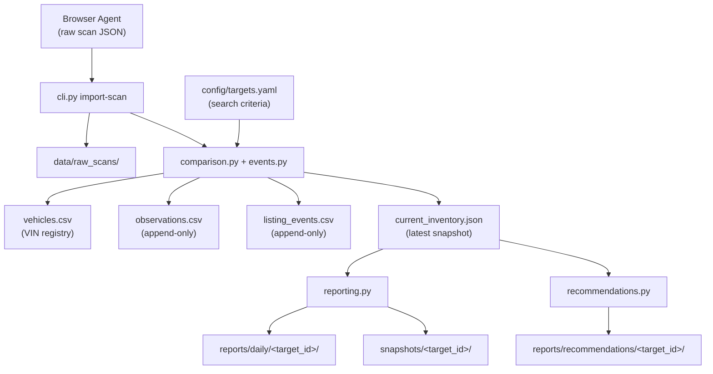

# clutch_tracker

Production-oriented Python project for tracking multiple vehicle search targets on [Clutch.ca](https://www.clutch.ca). Browser agents collect raw scan data; deterministic Python code maintains append-only history keyed by VIN.

## Architecture



### Design principles

| Rule | Implementation |
|------|----------------|
| No hard-coded vehicles | All criteria live in `config/targets.yaml` |
| Unique targets | Each entry has a `target_id`; duplicates rejected at validation |
| VIN as primary key | `vehicles.csv` registry keyed by VIN across all history |
| Append-only history | `observations.csv` and `listing_events.csv` are never overwritten |
| Partial scan safety | `scan_complete: false` never marks missing vehicles as removed |
| Unknown stays unknown | Missing fields remain empty/null; no inference |
| Repository is truth | Git-tracked files are the historical database, not agent memory |
| Atomic writes | Temp file + `os.replace()` for all structured data updates |
| Timestamps | ISO 8601 in `America/Toronto` (`config/settings.yaml`) |

### Data layout

Each configured target gets isolated storage:

```
data/targets/<target_id>/
├── vehicles.csv           # Permanent VIN registry
├── observations.csv       # Append-only scan observations
├── listing_events.csv     # Appeared / removed / price_changed events
└── current_inventory.json # Latest inventory snapshot

reports/daily/<target_id>/   # Generated markdown reports
reports/recommendations/<target_id>/  # Multi-dimensional recommendation reports
snapshots/<target_id>/       # Point-in-time inventory snapshots
data/raw_scans/              # Archived browser scan JSON
data/registry/targets.csv    # Target metadata registry
```

### Scan import pipeline

1. Browser agent writes a scan JSON file with `target_id`, `scan_id`, `scanned_at`, `scan_complete`, and `vehicles[]`.
2. `import-scan` archives the raw JSON to `data/raw_scans/<scan_id>.json`.
3. Deterministic Python code:
   - Appends one observation row per scanned vehicle.
   - Updates the VIN registry (`first_seen_at` / `last_seen_at`).
   - Emits listing events (appeared, removed, price_changed).
   - Rewrites `current_inventory.json` (active + removed statuses).
4. Removals are emitted **only** when `scan_complete: true` and a previously active VIN is absent.

## Installation

From the repository root (where `pyproject.toml` lives):

```bash
python -m venv .venv
source .venv/bin/activate   # Windows: .venv\Scripts\activate
pip install -e ".[dev]"
```

Verify the install:

```bash
clutch-tracker doctor
clutch-tracker list-targets
# or
python -m clutch_tracker list-targets
```

### Troubleshooting

**`ModuleNotFoundError: No module named 'clutch_tracker'` (sometimes works, sometimes fails)**

This is usually caused by **Conda `(base)` conflicting with `.venv`**, or a stale **`clutch_tracker/` folder at repo root** shadowing the real package under `src/`.

Fix:

```bash
conda deactivate          # repeat until (base) disappears from your prompt
source .venv/bin/activate
pip uninstall clutch-tracker -y
pip install -e ".[dev]"
clutch-tracker list-targets
```

**Fallback (always works from repo root):**

```bash
python run.py list-targets
python run.py doctor
```

**Do not** keep an old `clutch_tracker/` directory at the repo root — only `src/clutch_tracker/` should exist.

**`province=True` in list-targets output**

YAML parses unquoted `ON` / `OFF` as booleans. Always quote province codes in `config/targets.yaml`:

```yaml
province: "ON"   # correct
province: ON     # wrong — becomes true
```

## CLI usage

```bash
# Recommended (after pip install -e ".[dev]")
clutch-tracker list-targets
clutch-tracker doctor
clutch-tracker show-target ford-f150-ontario
clutch-tracker validate-config
clutch-tracker initialize-targets
clutch-tracker import-scan tests/fixtures/scan_complete.json
clutch-tracker generate-report --target ford-f150-ontario
clutch-tracker generate-recommendations --target ford-f150-ontario
clutch-tracker validate-repository

# Or via Python module
python -m clutch_tracker list-targets

# Fallback without pip install (from repo root)
python run.py list-targets
```

## Configuration

### `config/targets.yaml`

Define search targets with unique `target_id` values and criteria. Vehicle makes and models appear here only — never in Python source.

**Model-specific search** (e.g. Ford F-150):

```yaml
- target_id: ford-f150-ontario
  label: "Ontario Ford F-150"
  enabled: true
  criteria:
    make: Ford
    model: F-150
    model_aliases:       # alternate spellings (F150, F 150, …)
      - F150
      - F 150
    province: "ON"
    min_year: 2019
    max_year: 2024
    search_query: "Ford F-150"   # optional Clutch.ca search box text
```

Browser agents should call `show-target <target_id>` to retrieve the full search payload including `model_search_terms`.

### Recommendations report

`generate-recommendations` reads `current_inventory.json`, `vehicles.csv`, and `listing_events.csv` to produce a single markdown report with ranked picks across six dimensions:

| Dimension | Ranking logic |
|-----------|---------------|
| Best value | Lowest price-per-km (known price and mileage only) |
| Lowest price | Lowest current asking price |
| Low mileage | Lowest odometer reading |
| Best price by year | Cheapest listing per model year |
| New listings | Most recently first-seen listings |
| Recent price drops | Largest reductions from `price_changed` events |

Use `--top N` to control how many picks appear per section (default: 3). Partial scans (`scan_complete: false`) trigger a data-quality warning in the report.

Vehicles with explicit accident-history data are still tracked. Reported accidents are excluded from recommendations unless the scan details clearly indicate a minor/simple repair (for example, cosmetic damage or a low repair cost).

Browser agents may also include maintenance/service-history details in each vehicle object, such as `service_history`, `maintenance_records`, `service_locations`, `records_count`, `locations_count`, or `replaced_parts`. The importer normalizes those explicit fields into maintenance risk metadata in `current_inventory.json`, emits `maintenance_history_assessed` events when the assessment changes, and excludes high maintenance-risk listings from recommendation rankings while still showing them in the maintenance risk watchlist.

### `config/settings.yaml`

Global settings: timezone, logging, reporting fields, and scan behavior.

## Development

```bash
pytest
```

See [AGENTS.md](AGENTS.md) for AI agent operating instructions.

## Project structure

```
├── AGENTS.md
├── README.md
├── pyproject.toml
├── config/
│   ├── targets.yaml
│   └── settings.yaml
├── data/
│   ├── registry/
│   ├── raw_scans/
│   └── targets/
├── reports/
│   ├── daily/
│   ├── recommendations/
│   └── summary/
├── snapshots/
├── src/clutch_tracker/
│   ├── cli.py
│   ├── config.py
│   ├── models.py
│   ├── validation.py
│   ├── storage.py
│   ├── comparison.py
│   ├── events.py
│   ├── reporting.py
│   ├── recommendations.py
│   └── target_manager.py
└── tests/
```
