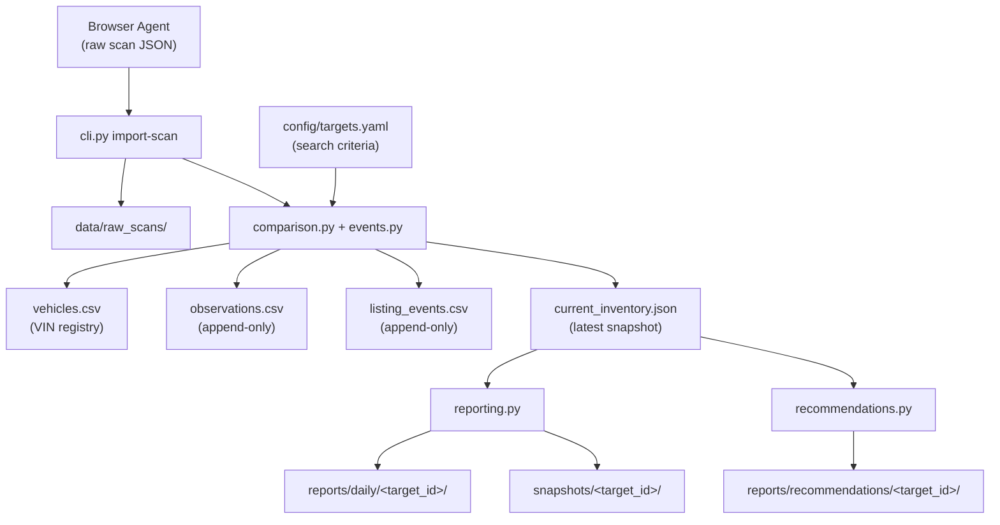

# clutch_tracker

Production-oriented Python project for tracking multiple vehicle search targets on [Clutch.ca](https://www.clutch.ca). Browser agents collect raw scan data; deterministic Python code maintains append-only history keyed by VIN.

## Architecture



### Design principles

| Rule | Implementation |
|------|----------------|
| No hard-coded vehicles | All criteria live in `config/targets.yaml` |
| Unique targets | Each entry has a `target_id`; duplicates rejected at validation |
| VIN as primary key | `vehicles.csv` registry keyed by VIN across all history |
| Append-only history | `observations.csv` and `listing_events.csv` are never overwritten |
| Partial scan safety | `scan_complete: false` never marks missing vehicles as removed |
| Unknown stays unknown | Missing fields remain empty/null; no inference |
| Repository is truth | Git-tracked files are the historical database, not agent memory |
| Atomic writes | Temp file + `os.replace()` for all structured data updates |
| Timestamps | ISO 8601 in `America/Toronto` (`config/settings.yaml`) |

### Data layout

Each configured target gets isolated storage:

```
data/targets/<target_id>/
├── vehicles.csv           # Permanent VIN registry
├── observations.csv       # Append-only scan observations
├── listing_events.csv     # Appeared / removed / price_changed events
└── current_inventory.json # Latest inventory snapshot

reports/daily/<target_id>/   # Generated markdown reports
reports/recommendations/<target_id>/  # Multi-dimensional recommendation reports
snapshots/<target_id>/       # Point-in-time inventory snapshots
data/raw_scans/              # Archived browser scan JSON
data/registry/targets.csv    # Target metadata registry
```

### Scan import pipeline

1. Browser agent writes a scan JSON file with `target_id`, `scan_id`, `scanned_at`, `scan_complete`, and `vehicles[]`.
2. `import-scan` archives the raw JSON to `data/raw_scans/<scan_id>.json`.
3. Deterministic Python code:
   - Appends one observation row per scanned vehicle.
   - Updates the VIN registry (`first_seen_at` / `last_seen_at`).
   - Emits listing events (appeared, removed, price_changed).
   - Rewrites `current_inventory.json` (active + removed statuses).
4. Removals are emitted **only** when `scan_complete: true` and a previously active VIN is absent.

## Installation

From the repository root (where `pyproject.toml` lives):

```bash
python -m venv .venv
source .venv/bin/activate   # Windows: .venv\Scripts\activate
pip install -e ".[dev]"
```

Verify the install:

```bash
clutch-tracker doctor
clutch-tracker list-targets
# or
python -m clutch_tracker list-targets
```

### Troubleshooting

**`ModuleNotFoundError: No module named 'clutch_tracker'` (sometimes works, sometimes fails)**

This is usually caused by **Conda `(base)` conflicting with `.venv`**, or a stale **`clutch_tracker/` folder at repo root** shadowing the real package under `src/`.

Fix:

```bash
conda deactivate          # repeat until (base) disappears from your prompt
source .venv/bin/activate
pip uninstall clutch-tracker -y
pip install -e ".[dev]"
clutch-tracker list-targets
```

**Fallback (always works from repo root):**

```bash
python run.py list-targets
python run.py doctor
```

**Do not** keep an old `clutch_tracker/` directory at the repo root — only `src/clutch_tracker/` should exist.

**`province=True` in list-targets output**

YAML parses unquoted `ON` / `OFF` as booleans. Always quote province codes in `config/targets.yaml`:

```yaml
province: "ON"   # correct
province: ON     # wrong — becomes true
```

## CLI usage

```bash
# Recommended (after pip install -e ".[dev]")
clutch-tracker list-targets
clutch-tracker doctor
clutch-tracker show-target ford-f150-ontario
clutch-tracker validate-config
clutch-tracker initialize-targets
clutch-tracker import-scan tests/fixtures/scan_complete.json
clutch-tracker generate-report --target ford-f150-ontario
clutch-tracker generate-recommendations --target ford-f150-ontario
clutch-tracker validate-repository
clutch-tracker serve
clutch-tracker serve --host 127.0.0.1 --port 8765

# Or via Python module
python -m clutch_tracker list-targets

# Fallback without pip install (from repo root)
python run.py list-targets
```

## Web UI

Start a local operations console that covers every CLI action, plus inventory / history / report browsing:

```bash
clutch-tracker serve
# or
python run.py serve
```

Then open http://127.0.0.1:8765/

| Page | What it does |
|------|----------------|
| 总览 | Rings, donut, year bars, price×mileage scatter; shortcuts to recs / inventory / import |
| 推荐 | Live ranked picks from **current active inventory only** (not sold / off-market). Refresh or write the markdown report. |
| 库存 | Vehicle cards with price/mileage meters and scatter |
| 走势 | Price sparkline and event-type mix |
| 导入 | Drag-and-drop scan JSON (this is the Scan action; the UI does not scrape Clutch.ca) |
| 报告 | Daily / recommendations archives |
| 运维 | Target chips, validate, initialize, doctor |

The server binds to `127.0.0.1` by default (local use only). It does not scrape Clutch.ca.

## Configuration

### `config/targets.yaml`

Define search targets with unique `target_id` values and criteria. Vehicle makes and models appear here only — never in Python source.

**Model-specific search** (e.g. Ford F-150):

```yaml
- target_id: ford-f150-ontario
  label: "Ontario Ford F-150"
  enabled: true
  criteria:
    make: Ford
    model: F-150
    model_aliases:       # alternate spellings (F150, F 150, …)
      - F150
      - F 150
    province: "ON"
    min_year: 2019
    max_year: 2024
    search_query: "Ford F-150"   # optional Clutch.ca search box text
```

Browser agents should call `show-target <target_id>` to retrieve the full search payload including `model_search_terms` and `scan_requirements`.

### Browser-agent Carfax scanning

`show-target` includes a `scan_requirements.vehicle_history_report` block. For each included vehicle, browser agents must open the vehicle detail page, go to the History section, follow the full Carfax report link when available, and write an explicit report object into the scan JSON. Python import code does not scrape Clutch or Carfax directly; it deterministically analyzes the browser agent's raw report fields.

Recommended scan shape:

```json
{
  "vin": "1FTFW1E50NFA12345",
  "listing_id": "clutch-123",
  "year": 2022,
  "make": "Ford",
  "model": "F-150",
  "price_cad": 45000,
  "mileage_km": 32000,
  "vehicle_history_report": {
    "provider": "carfax",
    "status": "scanned",
    "source_url": "https://...",
    "summary": "Accident/Damage Records Found",
    "accident_damage_records_count": 1,
    "total_accident_damage_amount_cad": 7342,
    "records": [
      {
        "date": "2024-04-10",
        "location": "Ontario",
        "type": "Accident Claim $5,000 - $9,999",
        "details": "Damage reported to front",
        "amount_cad": 7342
      }
    ]
  }
}
```

If the full report cannot be opened, agents must still record the attempt:

```json
"vehicle_history_report": {
  "provider": "carfax",
  "status": "blocked",
  "details": "WAF/captcha prevented report access"
}
```

Supported statuses are `scanned`, `blocked`, `error`, `unavailable`, and `not_scanned`. A scanned report with accident/damage records or positive claim amounts is tracked as reported accident history and is excluded from recommendation rankings unless details clearly indicate a minor/simple repair.

### Recommendations report

`generate-recommendations` reads `current_inventory.json`, `vehicles.csv`, `listing_events.csv`, and `config/targets.yaml` recommendation preferences to produce a markdown report with ranked picks across preference-aware dimensions:

| Dimension | Ranking logic |
|-----------|---------------|
| Best relative price | Preference-matched listings ranked by price below cohort median |
| Best price by year | Cheapest preference-matched listing per model year |
| Lowest mileage | Lowest odometer among preference-matched listings |
| New listings | Most recently first-seen preference-matched listings |
| Recent price drops | Largest reductions among preference-matched listings |
| Outside preference profile | Recommendable listings that fail trim profile filters |

Configure the preference cohort in `targets.yaml` under `criteria.recommendation_preferences`:

```yaml
recommendation_preferences:
  trim_must_contain:
    - "502A"
    - "Crew Cab"
    - "Short Bed"
  trim_must_not_contain:
    - "STX"
```

All tokens in `trim_must_contain` must appear in the listing trim string (case-insensitive). Unknown trim never satisfies a non-empty `trim_must_contain` list.

Use `--top N` to control how many picks appear per section (default: 3). Partial scans (`scan_complete: false`) trigger a data-quality warning in the report.

Vehicles with explicit accident-history data are still tracked. Reported accidents are excluded from recommendations unless the scan details clearly indicate a minor/simple repair (for example, cosmetic damage or a low repair cost). Excluded accident-risk vehicles remain visible in the recommendation report's Accident Risk Watchlist.

Browser agents may also include maintenance/service-history details in each vehicle object, such as `service_history`, `maintenance_records`, `service_locations`, `records_count`, `locations_count`, or `replaced_parts`. The importer normalizes those explicit fields into maintenance risk metadata in `current_inventory.json`, emits `maintenance_history_assessed` events when the assessment changes, and excludes high maintenance-risk listings from recommendation rankings while still showing them in the maintenance risk watchlist.

### `config/settings.yaml`

Global settings: timezone, logging, reporting fields, and scan behavior.

## Development

```bash
pytest
```

See [AGENTS.md](AGENTS.md) for AI agent operating instructions.

## Project structure

```
├── AGENTS.md
├── README.md
├── pyproject.toml
├── config/
│   ├── targets.yaml
│   └── settings.yaml
├── data/
│   ├── registry/
│   ├── raw_scans/
│   └── targets/
├── reports/
│   ├── daily/
│   ├── recommendations/
│   └── summary/
├── snapshots/
├── src/clutch_tracker/
│   ├── cli.py
│   ├── web.py
│   ├── static/              # Local web UI assets
│   ├── config.py
│   ├── models.py
│   ├── validation.py
│   ├── storage.py
│   ├── comparison.py
│   ├── events.py
│   ├── reporting.py
│   ├── recommendations.py
│   └── target_manager.py
└── tests/
```
