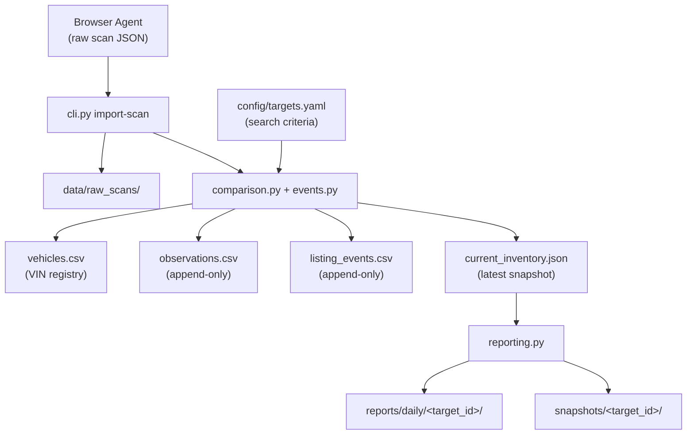

# clutch_tracker

Production-oriented Python project for tracking multiple vehicle search targets on [Clutch.ca](https://www.clutch.ca). Browser agents collect raw scan data; deterministic Python code maintains append-only history keyed by VIN.

## Architecture



### Design principles

| Rule | Implementation |
|------|----------------|
| No hard-coded vehicles | All criteria live in `config/targets.yaml` |
| Unique targets | Each entry has a `target_id`; duplicates rejected at validation |
| VIN as primary key | `vehicles.csv` registry keyed by VIN across all history |
| Append-only history | `observations.csv` and `listing_events.csv` are never overwritten |
| Partial scan safety | `scan_complete: false` never marks missing vehicles as removed |
| Unknown stays unknown | Missing fields remain empty/null; no inference |
| Repository is truth | Git-tracked files are the historical database, not agent memory |
| Atomic writes | Temp file + `os.replace()` for all structured data updates |
| Timestamps | ISO 8601 in `America/Toronto` (`config/settings.yaml`) |

### Data layout

Each configured target gets isolated storage:

```
data/targets/<target_id>/
├── vehicles.csv           # Permanent VIN registry
├── observations.csv       # Append-only scan observations
├── listing_events.csv     # Appeared / removed / price_changed events
└── current_inventory.json # Latest inventory snapshot

reports/daily/<target_id>/   # Generated markdown reports
snapshots/<target_id>/       # Point-in-time inventory snapshots
data/raw_scans/              # Archived browser scan JSON
data/registry/targets.csv    # Target metadata registry
```

### Scan import pipeline

1. Browser agent writes a scan JSON file with `target_id`, `scan_id`, `scanned_at`, `scan_complete`, and `vehicles[]`.
2. `import-scan` archives the raw JSON to `data/raw_scans/<scan_id>.json`.
3. Deterministic Python code:
   - Appends one observation row per scanned vehicle.
   - Updates the VIN registry (`first_seen_at` / `last_seen_at`).
   - Emits listing events (appeared, removed, price_changed).
   - Rewrites `current_inventory.json` (active + removed statuses).
4. Removals are emitted **only** when `scan_complete: true` and a previously active VIN is absent.

## Installation

```bash
cd clutch_tracker
python -m venv .venv
source .venv/bin/activate
pip install -e ".[dev]"
```

## CLI usage

```bash
# List configured targets
python -m clutch_tracker.cli list-targets

# Validate configuration
python -m clutch_tracker.cli validate-config

# Create on-disk directories and empty data files
python -m clutch_tracker.cli initialize-targets

# Import a browser scan
python -m clutch_tracker.cli import-scan tests/fixtures/scan_complete.json

# Generate a daily report
python -m clutch_tracker.cli generate-report --target pickup-trucks-ontario

# Validate repository integrity
python -m clutch_tracker.cli validate-repository
```

## Configuration

### `config/targets.yaml`

Define search targets with unique `target_id` values and criteria (body style, province, year range, etc.). Vehicle makes and models appear here only — never in Python source.

### `config/settings.yaml`

Global settings: timezone, logging, reporting fields, and scan behavior.

## Development

```bash
pytest
```

See [AGENTS.md](AGENTS.md) for AI agent operating instructions.

## Project structure

```
clutch_tracker/
├── AGENTS.md
├── README.md
├── pyproject.toml
├── config/
│   ├── targets.yaml
│   └── settings.yaml
├── data/
│   ├── registry/
│   ├── raw_scans/
│   └── targets/
├── reports/
│   ├── daily/
│   └── summary/
├── snapshots/
├── src/clutch_tracker/
│   ├── cli.py
│   ├── config.py
│   ├── models.py
│   ├── validation.py
│   ├── storage.py
│   ├── comparison.py
│   ├── events.py
│   ├── reporting.py
│   └── target_manager.py
└── tests/
```
